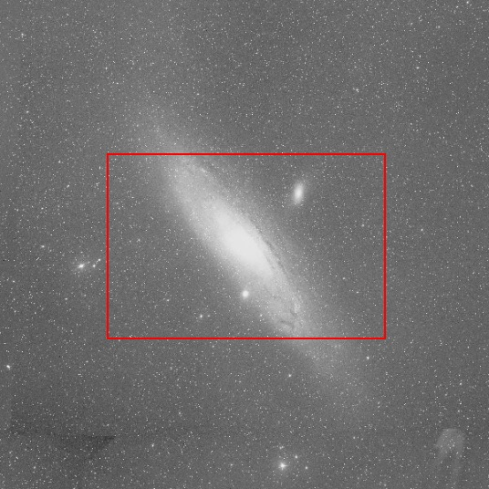

# Observation Field of View

Field of View is a simple web application to aid in astrophotographic
planning and composition. It allows you to determine how large a deep
sky object might appear based on the sensor-size of the capture device
(with common 35mm/DSLR/consumer camera sensor sizes as well as custom 
sizes) and the focal length of the lens or telescope, with the option to
include the modification factor of a focal reducer.

Images of the objects are retrieved from 
[NASA's SkyView](http://skyview.gsfc.nasa.gov/current/cgi/titlepage.pl).

## Example:

M31, framed for a 600mm telescope and an APS-C sensor:

## License

BSD. See [LICENSE file](LICENSE).

